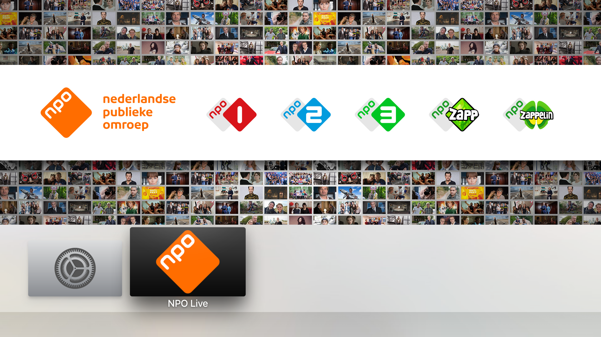
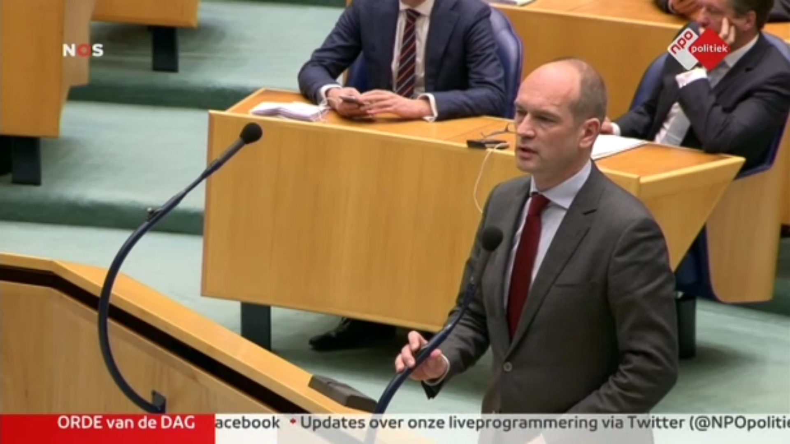

# NPO Live

NPO Live is an unofficial Apple TV application for watching NPO channels live, as we think using Airplay is not just ‘good enough’. [Source](http://www.iculture.nl/nederlandse-apple-tv-apps-omroepen-tv-aanbieders/) (Dutch)

The app focuses on the best user experience and to make it as easy as possible to see what is currently broadcasted on all the different channels. And by offering this, you don't have to go from channel to channel to determine what's the most interesting to watch.

The following channels are available to watch.

| Available NPO channels    |
| ------------------------- |
| NPO1                      |
| NPO2                      |
| NPO3                      |
| NPONieuws                 |
| NPOPolitiek               |
| NPO101                    |
| NPOCultura                |
| NPOZappXtra               |
| NPORadio1                 |
| NPORadio2                 |
| NPO3FM                    |
| NPORadio4                 |

## Changelog
* v1.0.1: Build fixed
* v1.0.0: Initial release

## Next releases
- Check for updates automatically
- Active show per channel
- While watching a channel, go directly to the next or previous channel
- Subtitle support
- Automatic refresh token after one hour of watching a show (known issue)

## Setup
As this is an unofficial app, not available on the App Store, you will need to _sideload_ it onto your Apple TV. To do so, you can follow the steps below.

#### What you will need
**Access to a computer running OS X**, which needs to be a version that is capable of running the version of Xcode that you will need. This is dependent on the version of your Apple TV: if you’re not running a beta, you can download the latest version of Xcode on [the Mac App Store](https://itunes.apple.com/us/app/xcode/id497799835?ls=1&mt=12). If not, you can download it from [developer.apple.com](https://developer.apple.com/xcode/download/).

**An Apple Developer account** (free).

**A USB Type C cable** to connect Apple TV to your computer.

1. Download the app by clicking _Download ZIP_ on GitHub.
2. Open `NPO Live.xcodeproj` from the download. This will open the app in Xcode.
3. Connect Apple TV to your computer.
4. Click on the project in the navigator on the left.
5. Alter the `Bundle Identifier` to include something unique, like your name.
6. Select your Apple TV in the list next to the play / stop-buttons at the top of Xcode.
7. Press the play button (or `⌘+R`) to install the app on Apple TV. If any popups appear, chose the developer account you set up as the `Development Team` to use and follow the steps.

### Updates
As this app is not publicly available on the App Store, you will have to manually update. To do so, follow the steps at _[Setup](#setup)_. You can check [the changelog](#changelog) to see if you are running an older version of the app.

### Help
If you run into any problems with the app or have suggestions on how it can be inproved, please let us know. You can do so by [creating an issue](https://github.com/Mauricevb/NPO-Live-Apple-TV-4/issues).

### Authors
[@hollanderbart](https://twitter.com/hollanderbart)

### License
MIT
